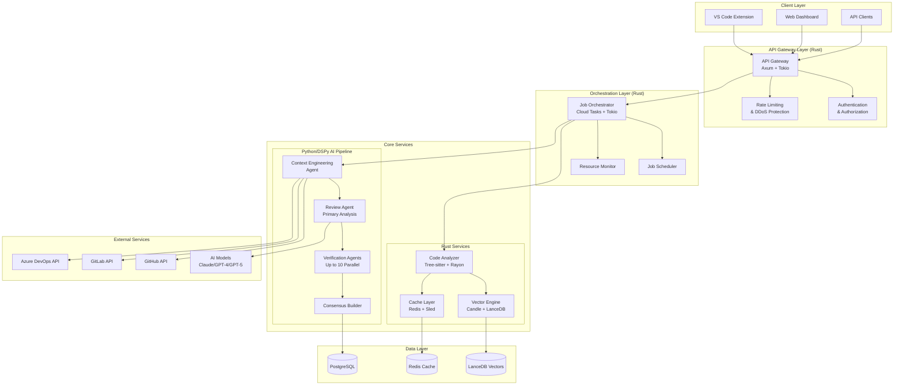
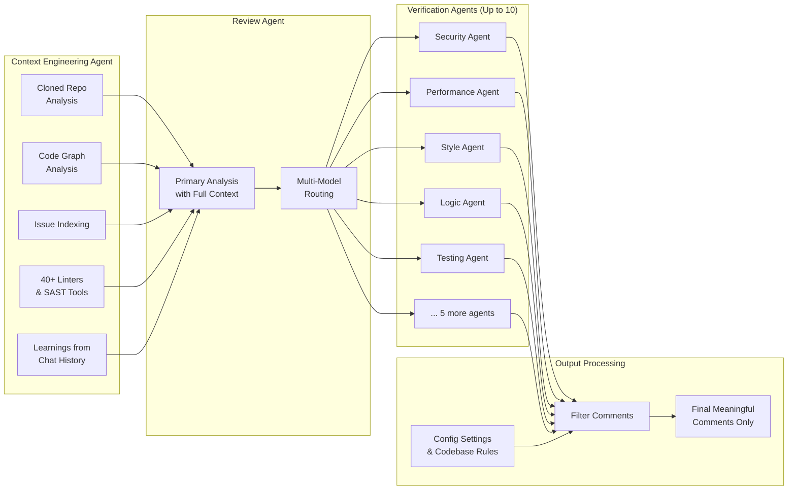

# CodeRabbit Migration Design Document

## Overview

This design document outlines the technical architecture for migrating from the 2022 GitHub Actions-based AI PR reviewer to the 2025 CodeRabbit platform. The design implements a hybrid architecture combining high-performance Rust services with Python-based DSPy AI pipeline optimization, deployed on Google Cloud Platform using cloud-native patterns.

## Architecture

### High-Level System Architecture



### Multi-Agent AI Pipeline Architecture



## Components and Interfaces

### 1. API Gateway (Rust/Axum)

**Purpose**: High-performance request handling and routing

**Key Features**:
- Async request processing with Tokio runtime
- Built-in rate limiting and DDoS protection
- JWT-based authentication and authorization
- Request/response logging and metrics
- Health checks and circuit breaker patterns

**Interface**:
```rust
#[derive(Serialize, Deserialize)]
pub struct ReviewRequest {
    pub repository: Repository,
    pub pull_request: PullRequest,
    pub config: OrganizationConfig,
}

#[derive(Serialize, Deserialize)]
pub struct ReviewResponse {
    pub review_id: String,
    pub status: ReviewStatus,
    pub comments: Vec<ReviewComment>,
    pub metrics: ReviewMetrics,
}

pub trait ApiGateway {
    async fn handle_webhook(&self, payload: WebhookPayload) -> Result<ReviewResponse>;
    async fn get_review_status(&self, review_id: &str) -> Result<ReviewStatus>;
    async fn cancel_review(&self, review_id: &str) -> Result<()>;
}
```

### 2. Job Orchestrator (Rust/Tokio + Cloud Tasks)

**Purpose**: Distributed job processing and resource management

**Key Features**:
- Async job queue management with Cloud Tasks
- Priority-based job scheduling
- Resource allocation and monitoring
- Job retry and failure handling
- Horizontal scaling coordination

**Interface**:
```rust
#[derive(Debug, Clone)]
pub struct ReviewJob {
    pub id: String,
    pub priority: JobPriority,
    pub repository: Repository,
    pub changes: Vec<FileChange>,
    pub config: ReviewConfig,
}

pub trait JobOrchestrator {
    async fn enqueue_review(&self, job: ReviewJob) -> Result<String>;
    async fn get_job_status(&self, job_id: &str) -> Result<JobStatus>;
    async fn cancel_job(&self, job_id: &str) -> Result<()>;
    async fn scale_workers(&self, target_count: u32) -> Result<()>;
}
```

### 3. Code Analyzer (Rust/Tree-sitter)

**Purpose**: High-performance code parsing and static analysis

**Key Features**:
- Multi-language AST parsing with tree-sitter
- Parallel file processing with Rayon
- Custom rule engine for pattern detection
- Integration with 40+ static analysis tools
- Zero-copy string operations for memory efficiency

**Interface**:
```rust
#[derive(Debug, Clone)]
pub struct CodeAnalysisResult {
    pub file_path: String,
    pub language: String,
    pub issues: Vec<Issue>,
    pub metrics: CodeMetrics,
    pub embeddings: Vec<f32>,
    pub ast_features: ASTFeatures,
}

pub trait CodeAnalyzer {
    async fn analyze_files(&self, files: Vec<FileChange>) -> Result<Vec<CodeAnalysisResult>>;
    async fn analyze_diff(&self, diff: &str, context: &RepoContext) -> Result<DiffAnalysis>;
    async fn extract_embeddings(&self, code: &str) -> Result<Vec<f32>>;
}
```

### 4. Vector Engine (Rust/Candle + LanceDB)

**Purpose**: High-performance vector operations and semantic search

**Key Features**:
- Fast embedding generation with Candle/ONNX
- Optimized vector similarity search
- Batch operations for high throughput
- Automatic indexing and rebalancing
- Memory-mapped storage for large datasets

**Interface**:
```rust
#[derive(Debug, Clone)]
pub struct SearchResult {
    pub content: String,
    pub similarity_score: f32,
    pub metadata: HashMap<String, String>,
}

pub trait VectorEngine {
    async fn generate_embeddings(&self, texts: Vec<String>) -> Result<Vec<Vec<f32>>>;
    async fn similarity_search(&self, query: &[f32], k: usize) -> Result<Vec<SearchResult>>;
    async fn batch_insert(&self, items: Vec<(String, Vec<f32>, HashMap<String, String>)>) -> Result<()>;
    async fn create_index(&self, dimension: usize) -> Result<String>;
}
```

### 5. DSPy AI Pipeline (Python)

**Purpose**: Automated AI prompt optimization and multi-agent orchestration

**Key Components**:

#### Context Engineering Agent
```python
class ContextEngineeringSignature(dspy.Signature):
    """Comprehensive context gathering for code review."""
    repo_structure: str = dspy.InputField(desc="Repository structure and metadata")
    code_changes: str = dspy.InputField(desc="PR changes and diff")
    historical_data: str = dspy.InputField(desc="Past PRs and issues")
    
    enriched_context: str = dspy.OutputField(desc="Comprehensive analysis context")
    code_relationships: str = dspy.OutputField(desc="AST-based code relationships")
    relevant_patterns: str = dspy.OutputField(desc="Historical patterns and learnings")

class ContextEngineeringAgent(dspy.Module):
    def __init__(self):
        super().__init__()
        self.context_generator = dspy.ChainOfThought(ContextEngineeringSignature)
        
    def forward(self, repo_data, changes, history):
        return self.context_generator(
            repo_structure=repo_data,
            code_changes=changes,
            historical_data=history
        )
```

#### Review Agent
```python
class ReviewAgentSignature(dspy.Signature):
    """Primary code review analysis with context."""
    enriched_context: str = dspy.InputField(desc="Context from engineering agent")
    code_changes: str = dspy.InputField(desc="Code changes to review")
    
    review_findings: str = dspy.OutputField(desc="Comprehensive review findings")
    confidence_scores: str = dspy.OutputField(desc="Confidence in each finding")
    suggested_improvements: str = dspy.OutputField(desc="Actionable improvement suggestions")

class ReviewAgent(dspy.Module):
    def __init__(self):
        super().__init__()
        self.reviewer = dspy.ChainOfThought(ReviewAgentSignature)
        self.model_router = ModelRouter()  # Intelligent model selection
        
    def forward(self, context, changes):
        return self.reviewer(
            enriched_context=context,
            code_changes=changes
        )
```

#### Verification Agents
```python
class VerificationAgentSignature(dspy.Signature):
    """Specialized verification for specific aspects."""
    review_findings: str = dspy.InputField(desc="Findings from review agent")
    specialization_context: str = dspy.InputField(desc="Domain-specific context")
    org_config: str = dspy.InputField(desc="Organization configuration")
    
    filtered_findings: str = dspy.OutputField(desc="Verified and filtered findings")
    relevance_score: float = dspy.OutputField(desc="Relevance score for findings")

class VerificationAgent(dspy.Module):
    def __init__(self, specialization: str):
        super().__init__()
        self.specialization = specialization
        self.verifier = dspy.ChainOfThought(VerificationAgentSignature)
        
    def forward(self, findings, context, config):
        return self.verifier(
            review_findings=findings,
            specialization_context=context,
            org_config=config
        )
```

### 6. Cache Layer (Rust/Redis + Sled)

**Purpose**: Multi-tier caching for performance optimization

**Key Features**:
- L1 Cache: In-memory with Sled (embedded key-value store)
- L2 Cache: Distributed Redis for shared state
- Intelligent cache invalidation
- Compression for large objects
- TTL-based expiration policies

**Interface**:
```rust
pub trait CacheLayer {
    async fn get<T: DeserializeOwned>(&self, key: &str) -> Result<Option<T>>;
    async fn set<T: Serialize>(&self, key: &str, value: &T, ttl: Duration) -> Result<()>;
    async fn invalidate(&self, pattern: &str) -> Result<()>;
    async fn get_stats(&self) -> Result<CacheStats>;
}
```

## Data Models

### Core Data Structures

```rust
#[derive(Debug, Clone, Serialize, Deserialize)]
pub struct Repository {
    pub id: String,
    pub name: String,
    pub owner: String,
    pub platform: Platform, // GitHub, GitLab, Azure DevOps
    pub clone_url: String,
    pub default_branch: String,
}

#[derive(Debug, Clone, Serialize, Deserialize)]
pub struct PullRequest {
    pub id: String,
    pub number: u32,
    pub title: String,
    pub description: String,
    pub author: User,
    pub base_branch: String,
    pub head_branch: String,
    pub files_changed: Vec<FileChange>,
}

#[derive(Debug, Clone, Serialize, Deserialize)]
pub struct FileChange {
    pub path: String,
    pub change_type: ChangeType, // Added, Modified, Deleted
    pub content: String,
    pub diff: String,
    pub language: String,
}

#[derive(Debug, Clone, Serialize, Deserialize)]
pub struct ReviewComment {
    pub id: String,
    pub file_path: String,
    pub line_number: u32,
    pub comment_type: CommentType, // Suggestion, Issue, Praise
    pub severity: Severity, // Low, Medium, High, Critical
    pub message: String,
    pub suggested_fix: Option<String>,
    pub confidence_score: f32,
}

#[derive(Debug, Clone, Serialize, Deserialize)]
pub struct OrganizationConfig {
    pub id: String,
    pub name: String,
    pub review_rules: ReviewRules,
    pub ai_settings: AISettings,
    pub integrations: Vec<Integration>,
}
```

### Database Schemas

#### PostgreSQL (Audit and Metadata)
```sql
-- Organizations and configuration
CREATE TABLE organizations (
    id UUID PRIMARY KEY,
    name VARCHAR(255) NOT NULL,
    config JSONB NOT NULL,
    created_at TIMESTAMP WITH TIME ZONE DEFAULT NOW(),
    updated_at TIMESTAMP WITH TIME ZONE DEFAULT NOW()
);

-- Review sessions and audit trail
CREATE TABLE review_sessions (
    id UUID PRIMARY KEY,
    organization_id UUID REFERENCES organizations(id),
    repository_id VARCHAR(255) NOT NULL,
    pr_number INTEGER NOT NULL,
    status VARCHAR(50) NOT NULL,
    started_at TIMESTAMP WITH TIME ZONE DEFAULT NOW(),
    completed_at TIMESTAMP WITH TIME ZONE,
    metrics JSONB,
    INDEX idx_org_repo (organization_id, repository_id),
    INDEX idx_status_time (status, started_at)
);

-- Review comments and feedback
CREATE TABLE review_comments (
    id UUID PRIMARY KEY,
    session_id UUID REFERENCES review_sessions(id),
    file_path VARCHAR(500) NOT NULL,
    line_number INTEGER,
    comment_type VARCHAR(50) NOT NULL,
    severity VARCHAR(20) NOT NULL,
    message TEXT NOT NULL,
    confidence_score FLOAT,
    created_at TIMESTAMP WITH TIME ZONE DEFAULT NOW()
);
```

#### LanceDB (Vector Storage)
```python
# Vector schema for semantic search
vector_schema = pa.schema([
    pa.field("id", pa.string()),
    pa.field("content", pa.string()),
    pa.field("embedding", pa.list_(pa.float32(), 1536)),  # OpenAI embedding dimension
    pa.field("metadata", pa.struct([
        ("file_path", pa.string()),
        ("repository", pa.string()),
        ("language", pa.string()),
        ("created_at", pa.timestamp('us'))
    ]))
])
```

## Error Handling

### Error Classification

```rust
#[derive(Debug, thiserror::Error)]
pub enum CodeRabbitError {
    #[error("Authentication failed: {0}")]
    AuthenticationError(String),
    
    #[error("Rate limit exceeded: {0}")]
    RateLimitError(String),
    
    #[error("Code analysis failed: {0}")]
    AnalysisError(String),
    
    #[error("AI service unavailable: {0}")]
    AIServiceError(String),
    
    #[error("Database operation failed: {0}")]
    DatabaseError(String),
    
    #[error("External API error: {0}")]
    ExternalAPIError(String),
}
```

### Error Recovery Strategies

1. **Retry with Exponential Backoff**: For transient failures
2. **Circuit Breaker**: For external service failures
3. **Graceful Degradation**: Fallback to cached results
4. **Dead Letter Queue**: For failed jobs requiring manual intervention
5. **Health Checks**: Proactive failure detection

### Monitoring and Alerting

```rust
pub struct ErrorMetrics {
    pub error_count: Counter,
    pub error_rate: Gauge,
    pub recovery_time: Histogram,
    pub circuit_breaker_state: Gauge,
}

impl ErrorHandler {
    pub async fn handle_error(&self, error: CodeRabbitError) -> Result<()> {
        // Log error with context
        tracing::error!(?error, "Processing error");
        
        // Update metrics
        self.metrics.error_count.inc();
        
        // Determine recovery strategy
        match error {
            CodeRabbitError::AIServiceError(_) => {
                self.circuit_breaker.record_failure().await;
                self.fallback_to_cache().await
            },
            CodeRabbitError::RateLimitError(_) => {
                self.apply_backoff().await
            },
            _ => self.retry_with_exponential_backoff().await
        }
    }
}
```

## Testing Strategy

### Testing Pyramid

#### Unit Tests (70%)
- **Rust Services**: Property-based testing with `proptest`
- **DSPy Pipeline**: Component testing with mock AI responses
- **Data Models**: Serialization/deserialization validation
- **Error Handling**: Comprehensive error scenario coverage

#### Integration Tests (20%)
- **API Gateway**: End-to-end request/response testing
- **Database Operations**: Transaction and consistency testing
- **External API Integration**: Mock service testing
- **Cache Layer**: Multi-tier cache coherence testing

#### End-to-End Tests (10%)
- **Complete Review Workflow**: Full pipeline testing
- **Multi-Platform Integration**: GitHub, GitLab, Azure DevOps
- **Performance Testing**: Load and stress testing
- **Security Testing**: Penetration and vulnerability testing

### Test Infrastructure

```rust
// Example test structure for Rust services
#[cfg(test)]
mod tests {
    use super::*;
    use proptest::prelude::*;
    use tokio_test;
    
    #[tokio::test]
    async fn test_code_analysis_performance() {
        let analyzer = CodeAnalyzer::new().await;
        let files = generate_test_files(1000);
        
        let start = Instant::now();
        let results = analyzer.analyze_files(files).await.unwrap();
        let duration = start.elapsed();
        
        assert!(duration < Duration::from_secs(10)); // 10x improvement target
        assert_eq!(results.len(), 1000);
    }
    
    proptest! {
        #[test]
        fn test_vector_operations_consistency(
            embeddings in prop::collection::vec(
                prop::collection::vec(-1.0f32..1.0f32, 1536), 
                1..100
            )
        ) {
            let rt = tokio::runtime::Runtime::new().unwrap();
            rt.block_on(async {
                let engine = VectorEngine::new().await;
                
                // Test that similarity search is consistent
                for embedding in embeddings {
                    let results1 = engine.similarity_search(&embedding, 5).await.unwrap();
                    let results2 = engine.similarity_search(&embedding, 5).await.unwrap();
                    assert_eq!(results1, results2);
                }
            });
        }
    }
}
```

### DSPy Testing Framework

```python
# DSPy evaluation and testing
class CodeReviewEvaluator:
    def __init__(self):
        self.metrics = [
            dspy.evaluate.answer_exact_match,
            self.comment_relevance_score,
            self.false_positive_rate,
            self.coverage_completeness
        ]
    
    def comment_relevance_score(self, prediction, ground_truth):
        """Custom metric for comment relevance."""
        # Implementation for measuring comment quality
        pass
    
    def evaluate_pipeline(self, pipeline, test_set):
        """Comprehensive pipeline evaluation."""
        evaluator = dspy.evaluate.Evaluate(
            devset=test_set,
            metric=self.composite_metric,
            num_threads=4
        )
        return evaluator(pipeline)

# Automated optimization
optimizer = dspy.MIPRO(
    metric=CodeReviewEvaluator().composite_metric,
    num_candidates=50,
    init_temperature=0.7
)

optimized_pipeline = optimizer.compile(
    student=CodeRabbitMultiAgentPipeline(),
    trainset=training_data,
    valset=validation_data
)
```

### Performance Benchmarks

Target performance metrics based on requirements:

- **Code Analysis Speed**: 10x faster than current (50ms vs 500ms per file)
- **Parallel Processing**: 100x improvement with multi-core utilization
- **Memory Usage**: 70% reduction through Rust zero-copy operations
- **AI Cost Optimization**: 40% reduction through DSPy optimization
- **Response Time**: <200ms for API requests
- **Throughput**: 100x current capacity with horizontal scaling

### Security Testing

1. **Static Analysis**: Rust's compile-time safety guarantees
2. **Dynamic Analysis**: Runtime security monitoring
3. **Penetration Testing**: Third-party security assessment
4. **Compliance Validation**: SOC 2 Type II requirements
5. **Vulnerability Scanning**: Automated dependency scanning

This design provides a comprehensive foundation for implementing the CodeRabbit migration with modern, high-performance architecture while maintaining the flexibility to evolve and scale.