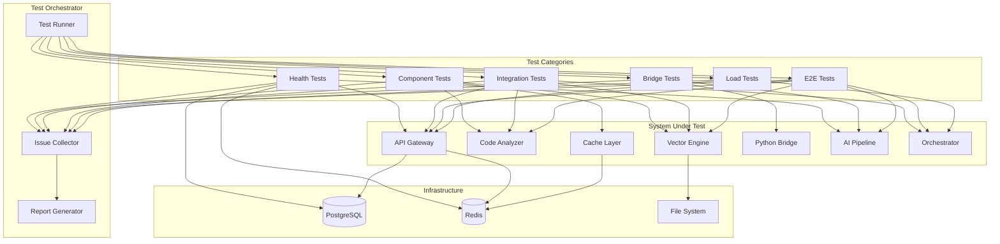

# System Integration Testing Design

## Overview

This design document outlines the architecture and approach for comprehensive system integration testing of CodeRabbit AI. The testing framework validates all components working together, identifies issues, and ensures production readiness.

## Architecture



## Components and Interfaces

### 1. Test Orchestrator

The central coordinator that runs all test categories in sequence and collects results.

```python
class TestOrchestrator:
    """Coordinates all integration tests and collects issues."""
    
    def __init__(self, config: TestConfig):
        self.config = config
        self.issue_collector = IssueCollector()
        self.report_generator = ReportGenerator()
    
    async def run_all_tests(self) -> TestReport:
        """Execute all test categories in order."""
        results = []
        
        # Phase 1: Health checks (must pass to continue)
        health_results = await self.run_health_tests()
        results.extend(health_results)
        if not self._all_passed(health_results):
            return self._generate_early_exit_report(results)
        
        # Phase 2: Component tests (parallel)
        component_results = await self.run_component_tests()
        results.extend(component_results)
        
        # Phase 3: Integration tests
        integration_results = await self.run_integration_tests()
        results.extend(integration_results)
        
        # Phase 4: E2E tests
        e2e_results = await self.run_e2e_tests()
        results.extend(e2e_results)
        
        # Phase 5: Load tests (optional)
        if self.config.run_load_tests:
            load_results = await self.run_load_tests()
            results.extend(load_results)
        
        return self.report_generator.generate(results)
```

### 2. Issue Collector

Captures and categorizes all discovered issues during testing.

```python
@dataclass
class Issue:
    """Represents a discovered issue."""
    id: str
    test_name: str
    component: str
    severity: Literal["critical", "high", "medium", "low"]
    category: str
    message: str
    stack_trace: Optional[str]
    logs: List[str]
    timestamp: datetime
    context: Dict[str, Any]

class IssueCollector:
    """Collects and categorizes issues from test failures."""
    
    def __init__(self):
        self.issues: List[Issue] = []
    
    def record_failure(
        self,
        test_name: str,
        component: str,
        error: Exception,
        severity: str = "medium",
        category: str = "unknown",
        context: Dict[str, Any] = None
    ) -> Issue:
        """Record a test failure as an issue."""
        issue = Issue(
            id=str(uuid.uuid4()),
            test_name=test_name,
            component=component,
            severity=severity,
            category=category,
            message=str(error),
            stack_trace=traceback.format_exc(),
            logs=self._capture_recent_logs(),
            timestamp=datetime.utcnow(),
            context=context or {}
        )
        self.issues.append(issue)
        return issue
    
    def get_summary(self) -> Dict[str, int]:
        """Get issue counts by severity."""
        return {
            "critical": len([i for i in self.issues if i.severity == "critical"]),
            "high": len([i for i in self.issues if i.severity == "high"]),
            "medium": len([i for i in self.issues if i.severity == "medium"]),
            "low": len([i for i in self.issues if i.severity == "low"]),
            "total": len(self.issues)
        }
```

### 3. Health Test Suite

Validates all components are running and accessible.

```python
class HealthTestSuite:
    """Tests for component health verification."""
    
    async def test_api_gateway_health(self):
        """Verify API Gateway responds to health check."""
        async with httpx.AsyncClient() as client:
            response = await client.get(
                f"{API_GATEWAY_URL}/health",
                timeout=30.0
            )
            assert response.status_code == 200
            data = response.json()
            assert data["status"] == "healthy"
    
    async def test_redis_connectivity(self):
        """Verify Redis is accessible."""
        redis = aioredis.from_url(REDIS_URL)
        result = await redis.ping()
        assert result is True
        await redis.close()
    
    async def test_postgres_connectivity(self):
        """Verify PostgreSQL accepts connections."""
        conn = await asyncpg.connect(DATABASE_URL)
        result = await conn.fetchval("SELECT 1")
        assert result == 1
        await conn.close()
    
    async def test_ai_pipeline_health(self):
        """Verify AI Pipeline server responds."""
        async with httpx.AsyncClient() as client:
            response = await client.get(
                f"{AI_PIPELINE_URL}/health",
                timeout=30.0
            )
            assert response.status_code == 200
```

### 4. Bridge Test Suite

Validates Rust-Python communication.

```python
class BridgeTestSuite:
    """Tests for Rust-Python bridge communication."""
    
    async def test_messagepack_serialization(self):
        """Verify MessagePack serialization works correctly."""
        test_data = {
            "files": [{"path": "test.py", "content": "print('hello')"}],
            "metadata": {"repo": "test/repo", "pr": 123}
        }
        
        # Serialize
        packed = msgpack.packb(test_data)
        
        # Send to bridge endpoint
        async with httpx.AsyncClient() as client:
            response = await client.post(
                f"{AI_PIPELINE_URL}/bridge/echo",
                content=packed,
                headers={"Content-Type": "application/msgpack"}
            )
            assert response.status_code == 200
            
            # Verify round-trip
            result = msgpack.unpackb(response.content)
            assert result == test_data
    
    async def test_shared_memory_transfer(self):
        """Verify shared memory transfer for large payloads."""
        # Create 50MB test payload
        large_payload = b"x" * (50 * 1024 * 1024)
        
        shm_path = f"/tmp/coderabbit_shm/test_{uuid.uuid4()}"
        os.makedirs(os.path.dirname(shm_path), exist_ok=True)
        
        with open(shm_path, "wb") as f:
            f.write(large_payload)
        
        async with httpx.AsyncClient() as client:
            response = await client.post(
                f"{AI_PIPELINE_URL}/bridge/shm_read",
                json={"shm_path": shm_path, "byte_len": len(large_payload)}
            )
            assert response.status_code == 200
            assert response.json()["bytes_read"] == len(large_payload)
        
        os.unlink(shm_path)
    
    async def test_batch_embedding_request(self):
        """Verify batch embedding processing."""
        texts = [f"def function_{i}(): pass" for i in range(100)]
        
        async with httpx.AsyncClient() as client:
            response = await client.post(
                f"{AI_PIPELINE_URL}/embeddings/batch",
                json={"texts": texts},
                timeout=60.0
            )
            assert response.status_code == 200
            embeddings = response.json()["embeddings"]
            assert len(embeddings) == 100
            assert len(embeddings[0]) == 384  # MiniLM dimension
```

### 5. Component Test Suites

Individual component validation.

```python
class CodeAnalyzerTestSuite:
    """Tests for Code Analyzer component."""
    
    async def test_ast_parsing_python(self):
        """Verify Python AST parsing."""
        code = '''
def hello(name: str) -> str:
    return f"Hello, {name}!"

class Greeter:
    def greet(self):
        return hello("World")
'''
        result = await self._analyze_code(code, "python")
        assert result["functions"] == 2
        assert result["classes"] == 1
    
    async def test_diff_analysis(self):
        """Verify diff analysis and risk scoring."""
        diff = '''
@@ -1,5 +1,8 @@
 def process_data(data):
-    return data
+    if not data:
+        raise ValueError("Empty data")
+    result = transform(data)
+    return result
'''
        result = await self._analyze_diff(diff)
        assert "changed_functions" in result
        assert result["risk_score"] >= 0
        assert result["risk_score"] <= 10
    
    async def test_parallel_file_processing(self):
        """Verify parallel processing of multiple files."""
        files = [
            {"path": f"file_{i}.py", "content": f"x = {i}"}
            for i in range(100)
        ]
        
        start = time.time()
        results = await self._analyze_files(files)
        elapsed = time.time() - start
        
        assert len(results) == 100
        assert elapsed < 10.0  # Should complete in under 10 seconds


class VectorEngineTestSuite:
    """Tests for Vector Engine component."""
    
    async def test_vector_insertion(self):
        """Verify vector storage in LanceDB."""
        vectors = [
            {"id": f"vec_{i}", "embedding": [0.1] * 384, "metadata": {"file": f"test_{i}.py"}}
            for i in range(100)
        ]
        
        result = await self._insert_vectors(vectors)
        assert result["inserted"] == 100
    
    async def test_similarity_search(self):
        """Verify k-NN search functionality."""
        query_vector = [0.1] * 384
        
        results = await self._search_vectors(query_vector, k=10)
        assert len(results) <= 10
        assert all("score" in r for r in results)
    
    async def test_batch_insertion_performance(self):
        """Verify batch insertion throughput."""
        vectors = [
            {"id": f"perf_{i}", "embedding": [random.random() for _ in range(384)]}
            for i in range(10000)
        ]
        
        start = time.time()
        result = await self._insert_vectors(vectors)
        elapsed = time.time() - start
        
        assert result["inserted"] == 10000
        assert elapsed < 30.0  # Should complete in under 30 seconds


class CacheLayerTestSuite:
    """Tests for Cache Layer component."""
    
    async def test_l1_cache_write_read(self):
        """Verify L1 (Sled) cache operations."""
        key = f"test_l1_{uuid.uuid4()}"
        value = {"data": "test_value"}
        
        await self._cache_set(key, value, tier="l1")
        result = await self._cache_get(key)
        
        assert result == value
    
    async def test_l2_cache_promotion(self):
        """Verify L2 hit promotes to L1."""
        key = f"test_l2_{uuid.uuid4()}"
        value = {"data": "test_value"}
        
        # Write directly to L2
        await self._cache_set(key, value, tier="l2")
        
        # Read should promote to L1
        result = await self._cache_get(key)
        assert result == value
        
        # Verify now in L1
        l1_result = await self._cache_get(key, tier="l1")
        assert l1_result == value
    
    async def test_cache_latency(self):
        """Verify cache latency requirements."""
        key = f"test_latency_{uuid.uuid4()}"
        value = {"data": "x" * 1000}
        
        await self._cache_set(key, value)
        
        # Measure L1 latency
        start = time.time()
        for _ in range(100):
            await self._cache_get(key, tier="l1")
        l1_latency = (time.time() - start) / 100
        
        assert l1_latency < 0.001  # < 1ms
```

### 6. Integration Test Suite

Tests for component interactions.

```python
class IntegrationTestSuite:
    """Tests for component integration."""
    
    async def test_webhook_to_job_queue(self):
        """Verify webhook creates job in queue."""
        webhook_payload = self._create_github_webhook_payload()
        signature = self._sign_payload(webhook_payload)
        
        async with httpx.AsyncClient() as client:
            response = await client.post(
                f"{API_GATEWAY_URL}/webhooks/github",
                json=webhook_payload,
                headers={"X-Hub-Signature-256": signature}
            )
            assert response.status_code == 202
            job_id = response.json()["job_id"]
        
        # Verify job in queue
        job = await self._get_job_status(job_id)
        assert job["status"] in ["queued", "processing"]
    
    async def test_analysis_to_vector_storage(self):
        """Verify code analysis results stored in vector engine."""
        # Submit code for analysis
        code = "def example(): return 42"
        analysis_result = await self._analyze_code(code, "python")
        
        # Generate embedding
        embedding = await self._generate_embedding(code)
        
        # Store in vector engine
        await self._store_vector(
            id=analysis_result["id"],
            embedding=embedding,
            metadata=analysis_result
        )
        
        # Verify searchable
        results = await self._search_vectors(embedding, k=1)
        assert len(results) == 1
        assert results[0]["id"] == analysis_result["id"]
    
    async def test_cache_integration_with_analysis(self):
        """Verify analysis results are cached."""
        code = "def cached_example(): return 123"
        
        # First analysis (cache miss)
        start1 = time.time()
        result1 = await self._analyze_code(code, "python")
        time1 = time.time() - start1
        
        # Second analysis (cache hit)
        start2 = time.time()
        result2 = await self._analyze_code(code, "python")
        time2 = time.time() - start2
        
        assert result1 == result2
        assert time2 < time1 * 0.5  # Cache hit should be significantly faster
```

### 7. E2E Test Suite

Complete workflow validation.

```python
class E2ETestSuite:
    """End-to-end workflow tests."""
    
    async def test_full_review_workflow(self):
        """Test complete PR review from webhook to comment."""
        # 1. Create mock PR data
        pr_data = self._create_mock_pr(
            files=[
                {"path": "src/main.py", "content": "def main(): pass"},
                {"path": "src/utils.py", "content": "def helper(): return 42"}
            ]
        )
        
        # 2. Send webhook
        webhook_payload = self._create_github_webhook_payload(pr_data)
        signature = self._sign_payload(webhook_payload)
        
        async with httpx.AsyncClient() as client:
            response = await client.post(
                f"{API_GATEWAY_URL}/webhooks/github",
                json=webhook_payload,
                headers={"X-Hub-Signature-256": signature}
            )
            assert response.status_code == 202
            job_id = response.json()["job_id"]
        
        # 3. Wait for job completion
        job = await self._wait_for_job_completion(job_id, timeout=120)
        assert job["status"] == "completed"
        
        # 4. Verify review was generated
        review = await self._get_review(job["review_id"])
        assert "comments" in review
        assert len(review["comments"]) >= 0
        
        # 5. Verify comments structure
        for comment in review["comments"]:
            assert "file" in comment
            assert "line" in comment
            assert "body" in comment
            assert "severity" in comment
    
    async def test_multi_agent_consensus(self):
        """Test verification agents reach consensus."""
        # Submit code with known issues
        code_with_issues = '''
def process_user_input(user_input):
    # Security issue: SQL injection
    query = f"SELECT * FROM users WHERE name = '{user_input}'"
    
    # Performance issue: N+1 query pattern
    for user in get_all_users():
        get_user_details(user.id)
    
    # Style issue: magic number
    if len(user_input) > 100:
        return None
'''
        
        result = await self._run_ai_pipeline(code_with_issues)
        
        # Verify multiple agents contributed
        assert "agent_findings" in result
        assert len(result["agent_findings"]) >= 3
        
        # Verify consensus was built
        assert "consensus_comments" in result
        assert any("security" in c["category"].lower() for c in result["consensus_comments"])
```

### 8. Load Test Suite

Performance and capacity validation.

```python
class LoadTestSuite:
    """Load and performance tests."""
    
    async def test_concurrent_requests(self):
        """Test API Gateway handles concurrent requests."""
        async def make_request():
            async with httpx.AsyncClient() as client:
                return await client.get(f"{API_GATEWAY_URL}/health")
        
        # 1000 concurrent requests
        tasks = [make_request() for _ in range(1000)]
        results = await asyncio.gather(*tasks, return_exceptions=True)
        
        successes = [r for r in results if isinstance(r, httpx.Response) and r.status_code == 200]
        assert len(successes) >= 950  # Allow 5% failure rate
    
    async def test_simultaneous_reviews(self):
        """Test processing multiple PR reviews simultaneously."""
        async def submit_review(pr_id: int):
            pr_data = self._create_mock_pr(pr_id=pr_id)
            webhook = self._create_github_webhook_payload(pr_data)
            
            async with httpx.AsyncClient() as client:
                response = await client.post(
                    f"{API_GATEWAY_URL}/webhooks/github",
                    json=webhook,
                    headers={"X-Hub-Signature-256": self._sign_payload(webhook)}
                )
                return response.json()["job_id"]
        
        # Submit 10 simultaneous reviews
        job_ids = await asyncio.gather(*[submit_review(i) for i in range(10)])
        
        # Wait for all to complete
        results = await asyncio.gather(*[
            self._wait_for_job_completion(job_id, timeout=300)
            for job_id in job_ids
        ])
        
        completed = [r for r in results if r["status"] == "completed"]
        assert len(completed) >= 8  # Allow 20% failure rate under load
    
    async def test_throughput(self):
        """Measure sustained throughput."""
        start = time.time()
        completed = 0
        target_duration = 60  # 1 minute test
        
        while time.time() - start < target_duration:
            try:
                await self._submit_and_complete_review()
                completed += 1
            except Exception:
                pass
        
        reviews_per_hour = completed * 60  # Extrapolate to hourly rate
        assert reviews_per_hour >= 50  # Minimum 50 reviews/hour
```

## Data Models

### Test Configuration

```python
@dataclass
class TestConfig:
    """Configuration for test execution."""
    api_gateway_url: str = "http://localhost:8080"
    ai_pipeline_url: str = "http://localhost:8081"
    redis_url: str = "redis://localhost:6379"
    database_url: str = "postgresql://localhost:5432/coderabbit"
    
    run_load_tests: bool = False
    load_test_duration: int = 60
    concurrent_requests: int = 1000
    
    timeout_health: int = 30
    timeout_analysis: int = 60
    timeout_review: int = 300
    
    github_webhook_secret: str = "test_secret"
```

### Test Report

```python
@dataclass
class TestReport:
    """Final test execution report."""
    run_id: str
    started_at: datetime
    completed_at: datetime
    duration_seconds: float
    
    total_tests: int
    passed: int
    failed: int
    skipped: int
    
    issues: List[Issue]
    issue_summary: Dict[str, int]
    
    component_results: Dict[str, ComponentResult]
    
    def to_json(self) -> str:
        """Export report as JSON."""
        return json.dumps(asdict(self), default=str, indent=2)
    
    def to_markdown(self) -> str:
        """Export report as Markdown."""
        # Generate human-readable report
        ...
```

## Error Handling

### Retry Strategy

```python
class RetryStrategy:
    """Configurable retry strategy for flaky tests."""
    
    def __init__(
        self,
        max_retries: int = 3,
        base_delay: float = 1.0,
        max_delay: float = 30.0,
        exponential_base: float = 2.0
    ):
        self.max_retries = max_retries
        self.base_delay = base_delay
        self.max_delay = max_delay
        self.exponential_base = exponential_base
    
    async def execute(self, func: Callable, *args, **kwargs):
        """Execute function with retry logic."""
        last_error = None
        
        for attempt in range(self.max_retries + 1):
            try:
                return await func(*args, **kwargs)
            except Exception as e:
                last_error = e
                if attempt < self.max_retries:
                    delay = min(
                        self.base_delay * (self.exponential_base ** attempt),
                        self.max_delay
                    )
                    await asyncio.sleep(delay)
        
        raise last_error
```

### Circuit Breaker

```python
class CircuitBreaker:
    """Circuit breaker for component failures."""
    
    def __init__(
        self,
        failure_threshold: int = 5,
        recovery_timeout: float = 30.0
    ):
        self.failure_threshold = failure_threshold
        self.recovery_timeout = recovery_timeout
        self.failures = 0
        self.last_failure_time = None
        self.state = "closed"
    
    async def call(self, func: Callable, *args, **kwargs):
        """Execute function with circuit breaker protection."""
        if self.state == "open":
            if time.time() - self.last_failure_time > self.recovery_timeout:
                self.state = "half-open"
            else:
                raise CircuitBreakerOpen("Circuit breaker is open")
        
        try:
            result = await func(*args, **kwargs)
            if self.state == "half-open":
                self.state = "closed"
                self.failures = 0
            return result
        except Exception as e:
            self.failures += 1
            self.last_failure_time = time.time()
            if self.failures >= self.failure_threshold:
                self.state = "open"
            raise
```

## Testing Strategy

### Test Execution Order

1. **Health Tests** (blocking) - Must pass before continuing
2. **Component Tests** (parallel) - Test individual components
3. **Integration Tests** (sequential) - Test component interactions
4. **E2E Tests** (sequential) - Test complete workflows
5. **Load Tests** (optional) - Test performance under load

### Issue Severity Classification

| Severity | Criteria | Example |
|----------|----------|---------|
| Critical | System unusable, data loss risk | Database connection failure |
| High | Major feature broken | Review pipeline fails |
| Medium | Feature degraded | Cache miss rate high |
| Low | Minor issue, workaround exists | Slow response time |

### Test Environment Requirements

- Docker Compose for local testing
- Kubernetes for staging/production testing
- Mock external APIs (GitHub, GitLab)
- Isolated test database
- Clean state between test runs
