# GitHub Operations - Visual Diagrams

## 1. High-Level Architecture Diagram

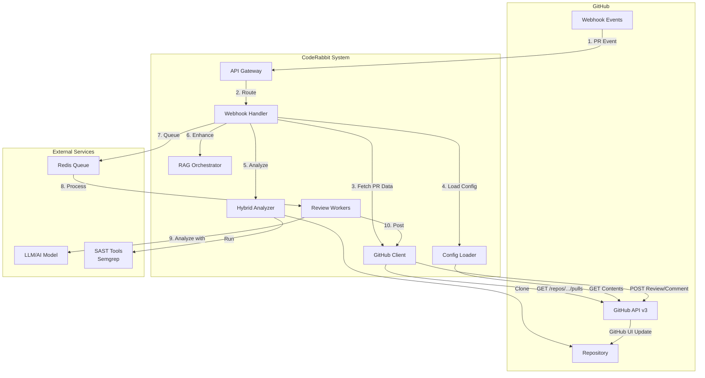

---

## 2. Webhook Lifecycle State Machine

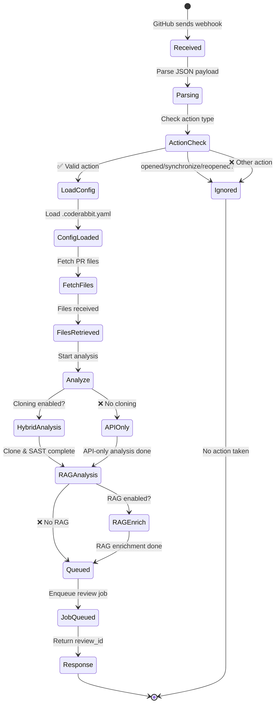

---

## 3. Complete Request Flow with Components

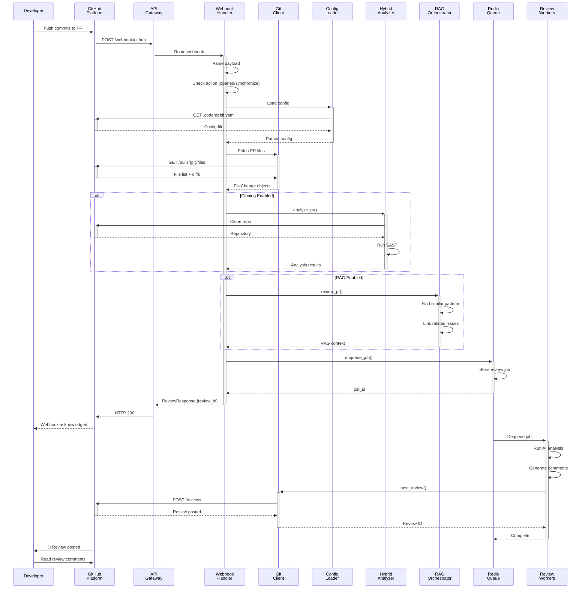

---

## 4. File Fetching Pipeline

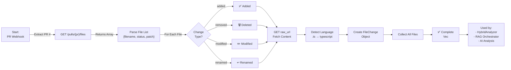

---

## 5. Comment Webhook Interaction

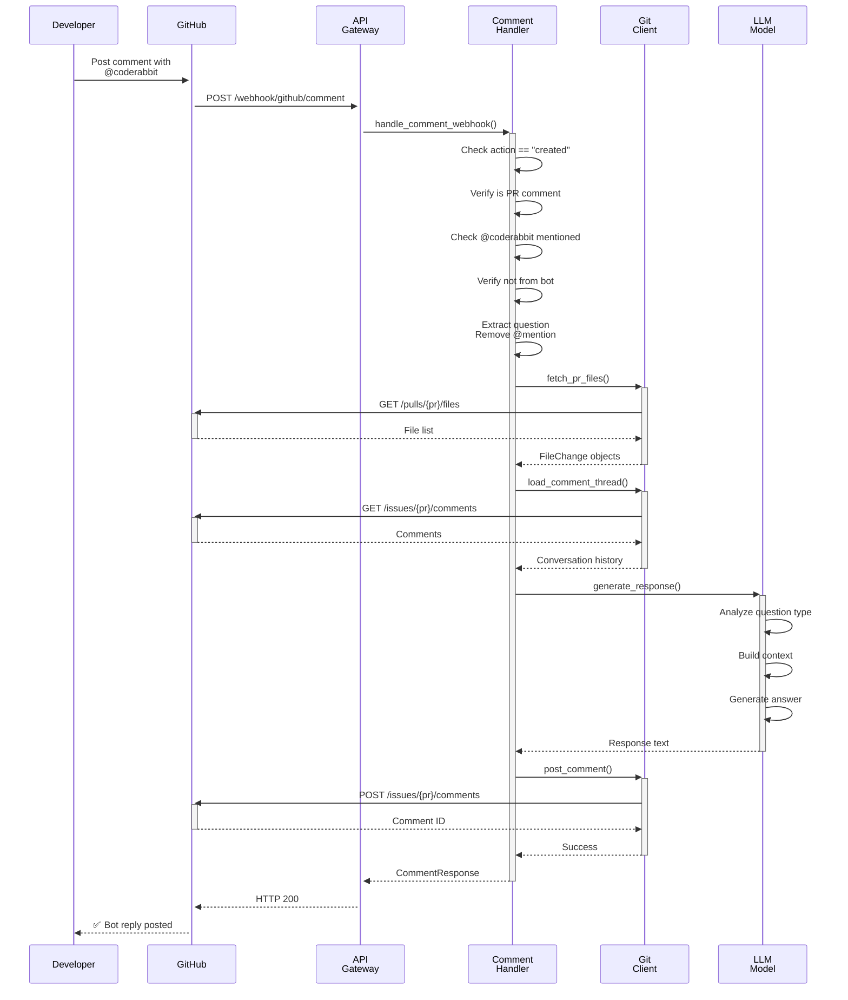

---

## 6. Analysis Decision Tree

```mermaid
graph TD
    Start["📥 Webhook Received"]
    
    Start --> LoadConf["Load .coderabbit.yaml"]
    LoadConf --> ConfCheck{Config<br/>Found?}
    
    ConfCheck -->|❌ Missing| UseDefault["Use default config"]
    ConfCheck -->|✅ Found| ParseConf["Parse & validate"]
    UseDefault --> Clone1{Cloning<br/>Enabled?}
    ParseConf --> Clone1
    
    Clone1 -->|❌ No| APIOnly["📡 API-Only Analysis"]
    Clone1 -->|✅ Yes| Clone["🔄 Clone Repository"]
    Clone --> SAST{SAST<br/>Enabled?}
    
    SAST -->|✅ Yes| RunSAST["🔍 Run SAST Scanner<br/>Semgrep, etc."]
    SAST -->|❌ No| SkipSAST["⏭️ Skip SAST"]
    RunSAST --> SASTDone["📊 Get metrics"]
    SkipSAST --> SASTDone
    
    SASTDone --> RAG1{RAG<br/>Enabled?}
    APIOnly --> RAG1
    
    RAG1 -->|❌ No| NoRAG["⏭️ Skip RAG"]
    RAG1 -->|✅ Yes| RunRAG["🧠 RAG Analysis"]
    RunRAG --> RAGTimeout{Timeout<br/>5s?}
    
    RAGTimeout -->|⏱️ Yes| TimeoutRAG["⚠️ Skip, continue"]
    RAGTimeout -->|❌ No| RAGComplete["📚 Similar patterns,<br/>related issues,<br/>best practices"]
    TimeoutRAG --> NoRAG
    RAGComplete --> NoRAG
    
    NoRAG --> Queue["📤 Queue Review Job"]
    Queue --> Return["↩️ Return review_id"]
    Return --> [*]
```

---

## 7. Performance & Error Handling

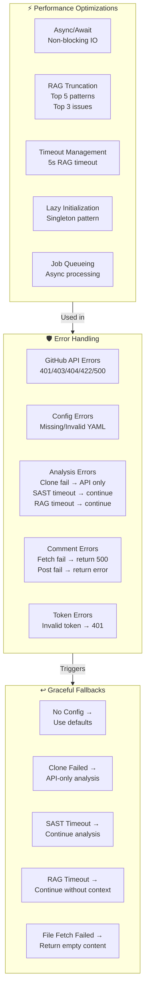

---

## 8. Security Architecture

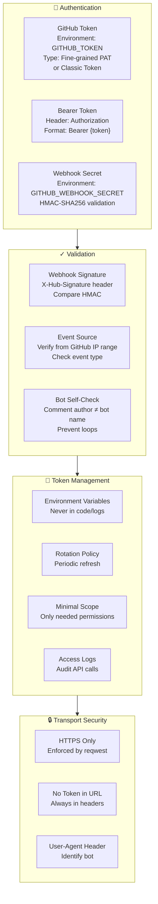

---

## 9. Multi-Platform Architecture

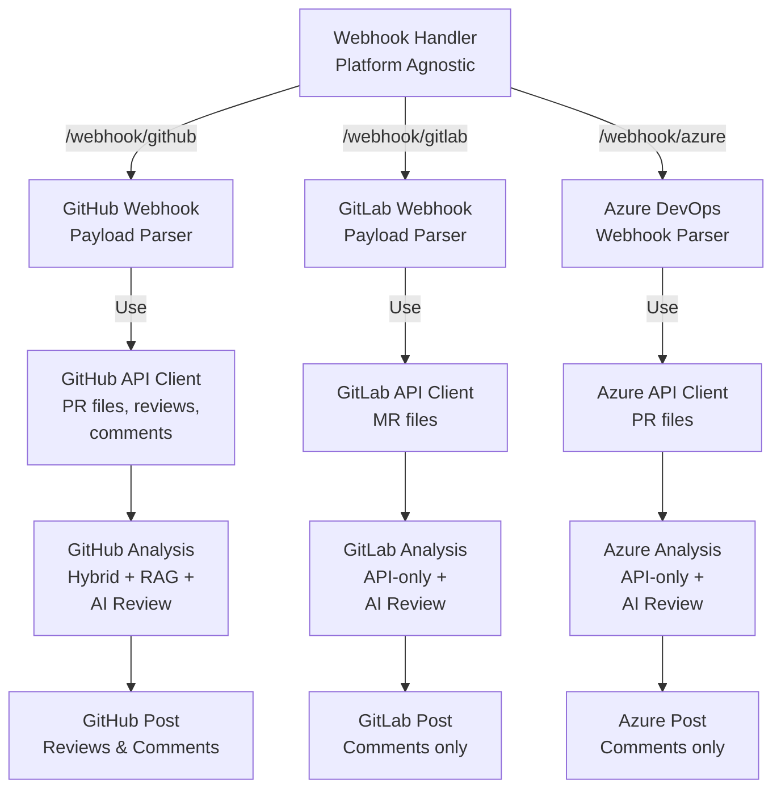

---

## 10. Data Flow - From PR Event to Posted Review

```mermaid
graph LR
    subgraph Input["1️⃣ Input"]
        I1["GitHub Webhook<br/>PR opened/updated"]
    end
    
    subgraph Fetch["2️⃣ Fetch Data"]
        F1["PR metadata"]
        F2["PR files & diffs"]
        F3["Configuration file"]
        F4[".coderabbit.yaml"]
    end
    
    subgraph Analyze["3️⃣ Analyze"]
        A1["Hybrid Analysis<br/>Code metrics<br/>SAST results"]
        A2["RAG Analysis<br/>Similar patterns<br/>Related issues<br/>Best practices"]
        A3["AI/LLM Analysis<br/>Generate insights<br/>Write comments"]
    end
    
    subgraph Process["4️⃣ Process"]
        P1["Format review<br/>body & comments"]
        P2["Calculate metrics"]
        P3["Prepare payload"]
    end
    
    subgraph Output["5️⃣ Output"]
        O1["POST /reviews"]
        O2["GitHub receives<br/>review"]
        O3["PR updated with<br/>comments"]
        O4["Developer<br/>notified"]
    end
    
    Input --> Fetch
    Fetch -->|GitHub API| Analyze
    Analyze --> Process
    Process --> Output
```

---

## 11. Configuration Flow

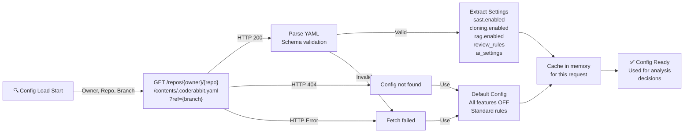

---

## 12. Review Posting Detail

```mermaid
sequenceDiagram
    participant Workers as Workers
    participant GitClient as GitHubClient
    participant GitHub as GitHub API
    participant UI as GitHub UI
    
    Workers->>Workers: 🧠 AI Analysis complete
    Workers->>Workers: Generate review body
    Workers->>Workers: Create inline comments
    
    Workers->>+GitClient: post_review(
    GitClient->>GitClient: Build request body
    GitClient->>GitClient: JSON payload:
    GitClient->>GitClient: - body: review text
    GitClient->>GitClient: - event: COMMENT/REQUEST_CHANGES
    GitClient->>GitClient: - comments: [
    GitClient->>GitClient: &nbsp;&nbsp;{path, position, body}
    GitClient->>GitClient: ]
    
    GitClient->>+GitHub: POST /repos/{o}/{r}/pulls/{pr}/reviews
    Note over GitHub: Validate request<br/>Check permissions<br/>Create review object
    GitHub-->>-GitClient: 201 Created<br/>Review ID
    
    GitClient-->>-Workers: Review ID
    
    GitHub->>+UI: Update PR view
    UI->>UI: Render review<br/>Show comments
    UI->>UI: Notify author
    UI-->>-GitHub: ACK
    
    Note over GitHub,UI: Developer sees review<br/>in PR timeline
```

---

## 13. RAG Context Integration

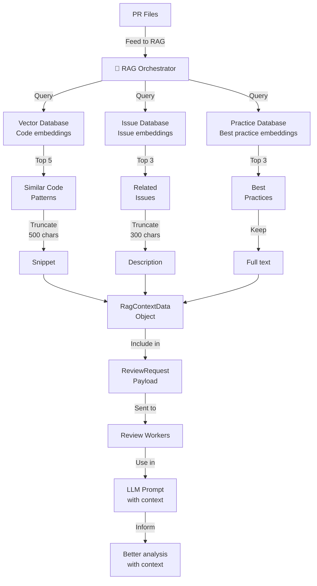

---

## 14. Error Recovery Paths

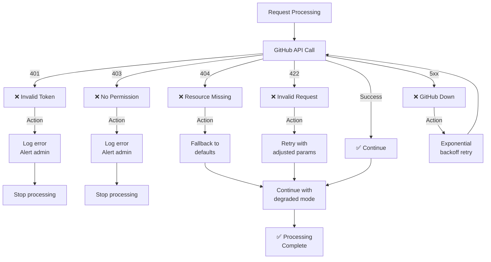

---

## 15. Request/Response Examples

### GitHub PR Webhook Payload Structure
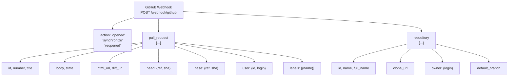

